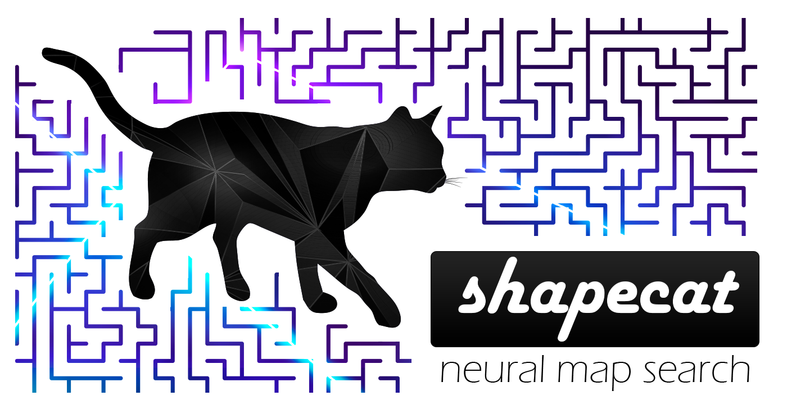

   

# shapecat
A command line tool to find running routes matching the shape of letters or emojis. Uses a deep convolutional neural network over open street map data.

# build.py [--character = ♥]
Builds a neural network model to identify the specified character / emoji. See --help for additional options.

# search.py [--city = "Seattle, WA, USA"]
Uses the neural network model to identify closed paths that. Supply a city in quotes. See --help for additional options.